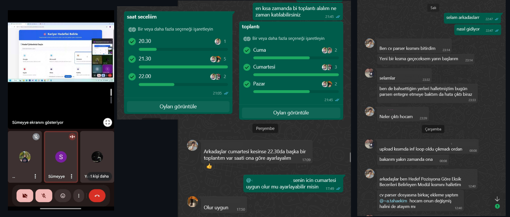
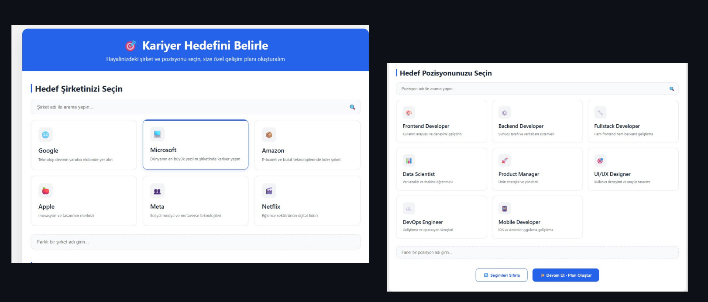

# Takım ve Ürün Bilgileri
## Takım İsmi
**Grup 68**

## Ürün İsmi
**PathMentor**

### Takım Üyeleri
| Ad - Soyad    | Görev           |
| ------------- |:-------------:|
| Ahmet Taha Ekim    | Product Owner |
| Yusuf Açık    | Developer |
| Sümeyye	Akgül   | Developer |
| Aslı Erol     | Developer |
| Elif Feyza Güneş | Scrum Master      |

## Ürün Açıklaması
PathMentor, kullanıcıların CV'lerini yükleyerek kariyer hedeflerine göre özelleştirilmiş gelişim planları ve görev önerileri alabilecekleri AI destekli bir kariyer koçluğu platformudur. Sistem, CV analizinden öğrenme planlamasına kadar tüm süreci otomatikleştirir ve kullanıcıya sürekli geri bildirim sunar.

## Ürün Özellikleri

- **AI Destekli CV Analizi:** PDF CV'leri okuyarak deneyim, beceri ve eğitim verilerini otomatik çıkarır.
- **Öğrenme Planı Oluşturma:** Kullanıcının hedef pozisyonuna uygun mikro hedefler ve görev listeleri önerir.
- **Mülakat Simülasyonu:** AI destekli mülakat soruları ve cevap analizi sağlar.
- **Geri Bildirim Üretimi:** Kullanıcıya gelişim alanları hakkında öneriler sunar.
- **Kariyer Öneri Sistemi:** Alternatif pozisyonlar ve gelişim yolları tavsiye eder.
- **Görev Takip Paneli:** Tamamlanan, bekleyen ve eksik görevlerin takibini kolaylaştırır.
- **Kaynak Öneri Modülü:** Udemy, YouTube, BTK Akademi gibi platformlardan kişiye özel eğitim içerikleri sunar.
- **Bildirim Sistemi:** Haftalık gelişim raporları ve hatırlatmalar gönderir.
- **Modern UI/UX:** Kullanıcı dostu, sade ve etkileşimli arayüz tasarımı.

## Hedef Kitle
- Yeni mezunlar ve iş arayan profesyoneller
- Üniversite öğrencileri
- Kariyer değişikliği yapmak isteyenler
- Kişisel gelişimine önem veren bireyler
  
## Dökümanlar
[Product Backlog](https://docs.google.com/document/d/1sP4ATmXhpBwG6lLdbFl9Ap5QrwLwr3Z1ELlGYSy_xB0/edit?tab=t.0)

  ---
# Sprint 1
*  Geliştirici ekip olarak, projenin bütün temel ihtiyaçlarını karşılayabileceğimizi test ettik ve projenin bir sonuca ulaşabileceğine emin olduk.
* **Sprint Notları:** Proje yönetimi, toplantı notları ve önemli tarihlerin hatırlatılması için Trello; fikir geliştirme, daily scrum, genel konuşmalar ve toplantılar için WhatsApp kullanılmasına karar verilmiştir.
  

* Sprint içinde tamamlanması beklenen puan 100 olarak belirlenmiştir.
  
* **Puan Tamamlama Mantığı:** Görevler, süre ve zorluk oranına göre 100 puan üzerinden orantılı puanlanmıştır. Her görev, iş yükünü dengeli yansıtacak şekilde puan almış ve sprint sonunda hedeflenen toplam puan tamamlanamamıştır.
* **Daily Scrum:** İletişim için WhatsApp grubu kullanılmış, günlük olarak değil, ihtiyaç oldukça yapılan scrum görüşmeleri gerçekleştirilmiştir.

### Sprint Review

- Sprint başlangıcında proje planlama ve hazırlık odaklı görevler önceliklendirildi.
- Ortak vizyon belirlendi, proje hedefleri ve milestone planları oluşturuldu.
- Takım rollerinin netleştirilmesi, fikirlerin değerlendirilmesi ve teknik altyapının (GitHub, Trello) hazırlanması tamamlandı.
- Product backlog hazırlandı ve öncelikli iş kalemleri belirlendi.
- Tüm ekip, toplantılara ve görüşmelere düzenli olarak katılım sağladı.
- Bu sprint dönemi yoğun sınav haftasına denk geldiği için geliştirme aşamasına ayrılan zaman kısıtlı kaldı.
- Bu nedenle UI/UX tasarımı ve fonksiyon geliştirme gibi uygulama odaklı görevlerde hedeflenen ilerleme düzeyi henüz tam olarak sağlanamadı.
- Önümüzdeki sprintte geliştirme sürecine ağırlık verilerek kalan işlerin tamamlanması hedeflenmektedir.

### Sprint Retrospective

- Planlama ve koordinasyon süreçleri verimli geçti, ekip iletişimi güçlüydü.
- Sınav dönemi nedeniyle görev paylaşımı ve uygulama aşamasına geçiş beklenenden daha yavaş ilerledi.
- Görevlerin öncelik sıralamasının netleştirilmesi ve zaman planlamasının daha esnek yapılması gerektiği görüldü.
- Bir sonraki sprintte geliştirme sürecinin hızlandırılması hedeflenmektedir.
- Ayrıca ilerlemenin düzenli takip edilmesi ve kritik görevlerin öncelikli tamamlanması için haftalık kontrol noktaları oluşturulacaktır.

---

# Sprint 2

* Sprint 1'den kalan görevler başarıyla tamamlandı ve geliştirme sürecine ivme kazandırıldı.  
* **Sprint Notları:** İletişim ve görev takibi için WhatsApp aktif olarak kullanılmış, tüm ekip görüşmelere düzenli olarak katılım sağlamıştır.

### Sprint Board  

### Toplantılar, Daily Scrum  

### Ürün Durumu  

* Sprint içinde tamamlanması beklenen puan 100 olarak belirlenmiştir.

* **Puan Tamamlama Mantığı:** Görevler zorluk ve sürelerine göre 100 puan üzerinden dengeli biçimde puanlanmıştır. Çıkarılan görevler hariç başarıyla tamamlanmıştır.

* **Daily Scrum:** İletişim için WhatsApp grubu kullanılmış, günlük değil, yoğunluk durumuna göre ihtiyaç oldukça scrum görüşmeleri gerçekleştirilmiştir, sesli toplantı sıklığı arttırılmıştır.

### Sprint Review

- Dashboard, Öğrenme Planı Sayfası ve AI destekli görev kartları gibi UI/UX odaklı tasarımlar tamamlandı.
- Yapay zekâ modüllerinden embedding çıkarımı, eksik beceri analizi ve mikro hedef planlayıcı modülleri geliştirildi.
- Kullanıcı giriş/kayıt sistemi başarıyla tamamlandı.
- Kullanıcı verisi, hedef pozisyon ve şirket bilgileri veritabanına kaydedildi.
- AI çıktıları ile arayüz entegrasyonları sağlandı; görev takibi ve bildirim sistemi temel seviyede aktive edildi.
- Önceki sprintte eksik kalan işlevler başarıyla tamamlandı, takım içi görev paylaşımı daha dengeli yürütüldü.
- Ekip üyeleri, tüm toplantılara olabildiğince katılım sağladı ve proje içi iletişimde yüksek etkileşim sağlandı.

### Sprint Retrospective

- Sprint kapsamına alınan mülakat simülasyonu arayüzü ise zaman sınırlamaları nedeniyle bu sprintte geliştirme dışı bırakılmış, Sprint 3'e aktarılmıştır. Vakit kalması durumunda bu sprint içerisinde de tamamlanabilir.
- Bu sprintte ekip koordinasyonu daha güçlüydü, görevler daha sistematik biçimde tamamlanmaya başlandı.
- Toplantı sıklığı artırılarak iletişim daha verimli hâle getirildi.
- Zaman yönetimi konusunda önceki sprintlere göre daha başarılı bir süreç izlendi.
- Kısıtlı zamana rağmen sprint hedeflerine ulaşmak için takım içi sorumluluk paylaşımı dengelendi.
- Bir sonraki sprintte son özelliklerin tamamlanması ve ürünün son hâlinin hazırlanması planlanmaktadır.

# Sprint 3
Bu sprintte, projenin gelişmiş modülleri tamamlanmış, kullanıcıya daha derinlemesine analiz ve rehberlik sunan özellikler eklenmiş, ayrıca proje teslimine yönelik final hazırlıkları gerçekleştirilmiştir.

Geliştirilen Modüller
Mülakat Simülasyonu AI Prompt Modülü
Kullanıcıya kişiselleştirilmiş mülakat soruları sunan yapay zeka destekli bir modül geliştirildi. LLM temelli senaryo üretimi ile gerçekçi ve pozisyonlara uygun mülakat deneyimi sağlandı.

Kullanıcı Cevap Analizi ve LLM ile Geri Bildirim
Kullanıcının verdiği mülakat cevapları doğal dil işleme ile analiz edildi. LLM ile otomatik geri bildirimler üretildi ve gelişim önerileri sunuldu.

Kullanıcının Gelişim Grafiği ve Haftalık Bildirimler
Kullanıcının performansı haftalık grafiklerle görselleştirildi. Kullanıcıya haftalık gelişim raporları bildirim veya e-posta yoluyla iletildi.

Görev Takip Paneli
Kullanıcının görevlerini takip edebileceği ve tamamlanma durumlarını görebileceği bir panel oluşturuldu. Görev filtreleme ve sıralama desteği sağlandı.

Kariyer Öneri Sistemi ve Alternatif Pozisyon Modülü
Kullanıcının tercihleri ve analizlerine göre kariyer yolları önerildi. Ayrıca benzer pozisyonlara dair alternatifler sunuldu ve bu pozisyonlara dair bilgilendirme kartları hazırlandı.

Final Hazırlıkları
Yapılan İşlerin Birleştirilmesi
Modüller arası bağlantılar entegre edildi. Uygulamanın uçtan uca sorunsuz çalışması sağlandı.

Dashboard Temizliği ve UI Tutarlılık Kontrolleri
Kullanıcı arayüzünde stil, ikon, font ve renk tutarlılığı sağlandı. Gereksiz UI karmaşıklıkları sadeleştirildi.

Tanıtım Videosu ve Senaryo Hazırlığı
Projenin genel işleyişini ve özelliklerini anlatan kısa bir tanıtım videosu hazırlandı. Senaryo ve çekim planı tamamlandı.

Demo Sunumu için Slaytlar
Demo sunumunda kullanılmak üzere görsel açıdan zengin, düzenli ve anlaşılır slaytlar oluşturuldu.

Proje Kapanış Dokümantasyonu
Kod yapısı, kullanım adımları, sistem gereksinimleri ve modül açıklamalarını içeren kapanış dökümanı hazırlandı.

GitHub Temizliği ve ReadMe Düzenlemesi
Gereksiz dosyalar kaldırıldı, dizin yapısı sadeleştirildi. README dosyası kurulum, kullanım ve katkı başlıkları ile yeniden düzenlendi.

Toplantılar ve Süreç Takibi
Sprint Review ve Retrospective
Sprint sonunda geliştirilen tüm işler gözden geçirildi. Nelerin iyi gittiği ve nelerin geliştirilebileceği değerlendirildi.

Görev Yönetimi Takibi
Sprint boyunca görev yönetim aracı üzerinden iş takibi ve güncellemeler düzenli olarak yapıldı.

Toplantı Notlarının Düzenlenmesi
Tüm haftalık toplantı notları bir araya getirildi ve merkezi bir belgede düzenli olarak tutuldu.

Danışman Toplantılarına Katılım
Danışman ile düzenli olarak yapılan görüşmelere katılım sağlandı ve alınan geri bildirimler sprint çıktısına yansıtıldı.

  

